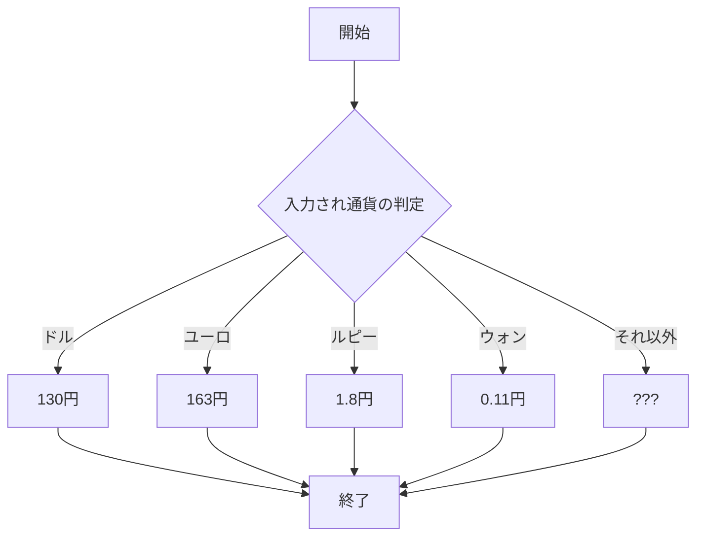
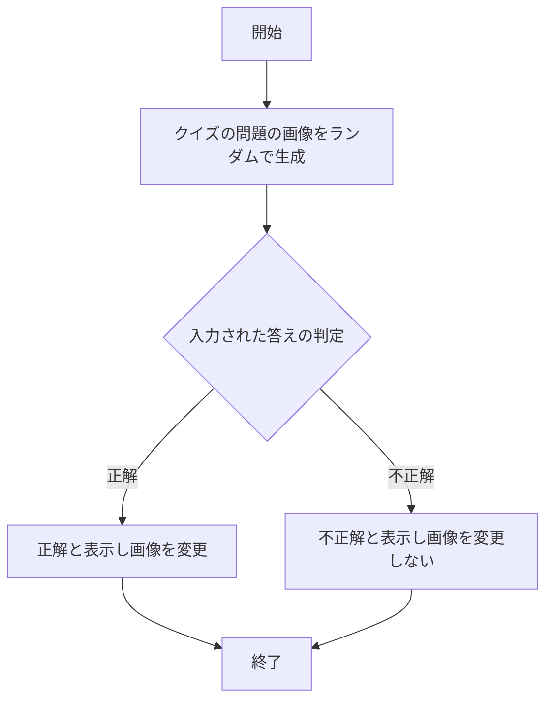

# webpro_06

## このプログラムについて

## ファイル一覧

ファイル名 | 説明
-|-
app5.js | プログラム本体
kawase.ejs| 為替を表示するプログラム
kuizu.ejs|国旗クイズを表示するプログラム

## 概要
#### kawase.ejsの概要
入力画面に調べたい通貨をカタカナで入力すると調べた通貨の日本円の価格を表示される.ただし調べられるのはドル，ウォン，ルピー，ユーロのみ．他の通貨や関係のない言葉を入力した場合？？？と表示される．

#### kuizu.ejsの概要
サイトを開くと日本もしくはイギリス,アメリカの国旗がランダムで表示される.下の入力欄に表示されている国旗の国名を入力すると正解と表示され,また3つのうちのどれかがランダムに表示される.入力欄に間違った答えや関係のない言葉を入力すると不正解と表示され，画像は変更されない.

## 使用方法

#### kawase.ejsの使用方法
1. app5.js を起動する
1. Webブラウザでlocalhost:8080/kawaseにアクセスする
1. 調べたい通貨を入力する

#### kuizu.ejsの使用方法
1. app5.js を起動する
1. Webブラウザでlocalhost:8080/kuizuにアクセスする
1. 表示された国旗の答えを書く
1. 正解なら次の問題が表示され不正解ならそのままの状態のままになる

## フローチャート

#### kawaseのフローチャート

#### kawaseのフローチャート
